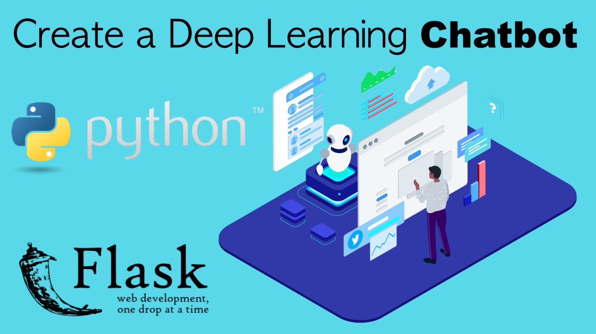
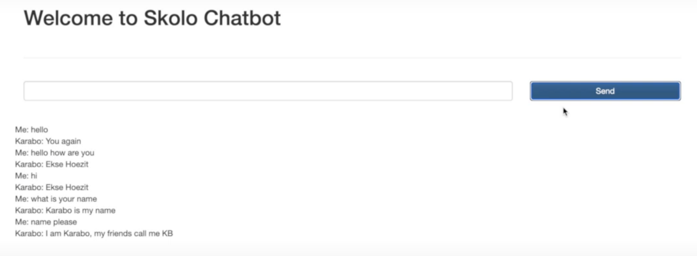

Create a Deep Learning Chatbot with Python and Flask 
====================================================


In this lab we are going to be creating our own intelligent deep
learning chatbot with Python and Flask. Deep learning is a field of
machine learning that uses algorithms that mimic the human brain,
working like the neural networks and connections. 

Don't worry, we are not going to go in to deep learning mathematics or
algorithms in this lab. I am just going to show you the libraries
and concepts from deep learning that you need to build a chatbot using
Python.




We are going to cover the following in this deep learning chatbot with Python and Flask lab 
-----------------------------------------------------------------------------------------------

- Creating the intents file for your chatbot
- Building our deep learning model
- Processing the sentences or questions being asked to the chatbot
- Create a Flask app front end
- Test our chatbot

Chatbot intents file 
====================

This is arguably the most important code you are going to work with when
building your chatbot. The chatbot intents file is where you add
information about the type of questions your chatbot should be expecting
and typical responses.

In mathematics, algorithms and models we have a saying: *"Junk in, junk
out".*

The quality of your intents file will determine the quality of your
chatbot, be very clear about typical questions, also don't offer too
many alternatives but enough to cover the many ways people can ask a
question.

Here is an example of an intent:

```
{"tag": "goodbye",
 "patterns": ["Bye", "See you later", "Goodbye", "Ok bye", "Bye Bye"],
  "responses": ["See you!", "Have a nice day", "Sure Bye", "Later dude", "Sayoonara", "Peace out", "Sure dude", "Ciao"]
    }
```

So you basically need a:

1.  [tag for the intent;]
2.  [patterns for questions;]
3.  [a response. The response can be a fixed response or options the bot
    will choose randomly from.]

The most important part of this intent object is the patterns --- this
is what will help train the chatbot to recognise a question, so it can
associate it with a specific tag. This is where you need to spend time
working the data that goes in to the model.

Add as many intents as you like in a list of objects to the intents
file.

Building the deep learning model 
================================

You will need Python, a virtual environment and code editor to complete
these.

Inside your working directory you should have the following files:

```
|
|______ static
|          |______ jquery.min.js
|
|______ templates
|           |______ index.html
|
|____ app.py
|____ chatbot.py
|____ job_intents.json
|____ processor.py 
```

Once you are set-up, run the following commands:

This will install the virtual env

```
virtualenv chatenv
```

This will activate it and install the libraries you need:

```
source chatenv/bin/activate
pip install nltk numpy keras tensorflow flask
```

Then create a model file:

Make sure you have your intents file saved in the same location, it
should be a json life with a list of intents objects as described in the
section above.

```
nano chatbot.py
```

Paste this in the file:

```
import nltk
nltk.download('punkt')
nltk.download('wordnet')
from nltk.stem import WordNetLemmatizer
lemmatizer = WordNetLemmatizer()
import json
import pickle

import numpy as np
from keras.models import Sequential
from keras.layers import Dense, Activation, Dropout
from keras.optimizers import SGD
import random

words=[]
classes = []
documents = []
ignore_words = ['?', '!']
data_file = open('job_intents.json', encoding='utf-8').read()
intents = json.loads(data_file)


for intent in intents['intents']:
    for pattern in intent['patterns']:

        w = nltk.word_tokenize(pattern)
        words.extend(w)

        documents.append((w, intent['tag']))


        if intent['tag'] not in classes:
            classes.append(intent['tag'])

words = [lemmatizer.lemmatize(w.lower()) for w in words if w not in ignore_words]
words = sorted(list(set(words)))

classes = sorted(list(set(classes)))

print (len(documents), "documents")

print (len(classes), "classes", classes)

print (len(words), "unique lemmatized words", words)


pickle.dump(words,open('words.pkl','wb'))
pickle.dump(classes,open('classes.pkl','wb'))

# initializing training data
training = []
output_empty = [0] * len(classes)
for doc in documents:

    bag = []

    pattern_words = doc[0]
    pattern_words = [lemmatizer.lemmatize(word.lower()) for word in pattern_words]

    for w in words:
        bag.append(1) if w in pattern_words else bag.append(0)


    output_row = list(output_empty)
    output_row[classes.index(doc[1])] = 1

    training.append([bag, output_row])

random.shuffle(training)
training = np.array(training)
# create train and test lists. X - patterns, Y - intents
train_x = list(training[:,0])
train_y = list(training[:,1])
print("Training data created")


# Create model - 3 layers. First layer 128 neurons, second layer 64 neurons and 3rd output layer contains number of neurons
# equal to number of intents to predict output intent with softmax
model = Sequential()
model.add(Dense(128, input_shape=(len(train_x[0]),), activation='relu'))
model.add(Dropout(0.5))
model.add(Dense(64, activation='relu'))
model.add(Dropout(0.5))
model.add(Dense(len(train_y[0]), activation='softmax'))

# Compile model. Stochastic gradient descent with Nesterov accelerated gradient gives good results for this model
sgd = SGD(lr=0.01, decay=1e-6, momentum=0.9, nesterov=True)
model.compile(loss='categorical_crossentropy', optimizer=sgd, metrics=['accuracy'])

#fitting and saving the model
hist = model.fit(np.array(train_x), np.array(train_y), epochs=200, batch_size=5, verbose=1)
model.save('chatbot_model.h5', hist)

print("model created")

```

When you finish, you can save and run the file with:

```
python chatbot.py
```

This file will then create a model for your chatbot. You will notice a
new file created in the same directory called: **chatbot\_model.h5**.
Don't delete this file.

Anytime you update the contents of your intents file, you will need to
re-run this file to update the model. This file basically creates your
model based on the training data from intents file.

Processing the sentences 
========================

Create a new file in the same directory for dealing with the input in to
the model, processing the question and making predictions from the model
on what the appropriate response should be:

```
nano processor.py
```

Paste these contents:

```
import nltk
from nltk.stem import WordNetLemmatizer
lemmatizer = WordNetLemmatizer()
import pickle
import numpy as np

from keras.models import load_model
model = load_model('chatbot_model.h5')
import json
import random
intents = json.loads(open('job_intents.json', encoding='utf-8').read())
words = pickle.load(open('words.pkl','rb'))
classes = pickle.load(open('classes.pkl','rb'))


def clean_up_sentence(sentence):
    sentence_words = nltk.word_tokenize(sentence)
    sentence_words = [lemmatizer.lemmatize(word.lower()) for word in sentence_words]
    return sentence_words

# return bag of words array: 0 or 1 for each word in the bag that exists in the sentence

def bow(sentence, words, show_details=True):
    # tokenize the pattern
    sentence_words = clean_up_sentence(sentence)
    # bag of words - matrix of N words, vocabulary matrix
    bag = [0]*len(words)
    for s in sentence_words:
        for i,w in enumerate(words):
            if w == s:
                # assign 1 if current word is in the vocabulary position
                bag[i] = 1
                if show_details:
                    print ("found in bag: %s" % w)
    return(np.array(bag))

def predict_class(sentence, model):
    # filter out predictions below a threshold
    p = bow(sentence, words, show_details=False)
    res = model.predict(np.array([p]))[0]
    ERROR_THRESHOLD = 0.25
    results = [[i,r] for i,r in enumerate(res) if r>ERROR_THRESHOLD]
    # sort by strength of probability
    results.sort(key=lambda x: x[1], reverse=True)
    return_list = []
    for r in results:
        return_list.append({"intent": classes[r[0]], "probability": str(r[1])})
    return return_list

def getResponse(ints, intents_json):
    tag = ints[0]['intent']
    list_of_intents = intents_json['intents']
    for i in list_of_intents:
        if(i['tag']== tag):
            result = random.choice(i['responses'])
            break
        else:
            result = "You must ask the right questions"
    return result

def chatbot_response(msg):
    ints = predict_class(msg, model)
    res = getResponse(ints, intents)
    return res

```

Close the file and we can now work on the Flask application:

Flask Chatbot Application --- Front End 
=======================================

You will notice we have a static and templates folder, make sure you get
a jquery file in the static folder. For the templates folder, create a
file called index.html and paste the following inside it:

```
<!DOCTYPE html>
<html lang="en" dir="ltr">
  <head>
    <meta charset="utf-8"><meta charset="utf-8">
    <meta http-equiv="x-ua-compatible" content="ie=edge">
    <meta name="description" content="">
    <meta name="viewport" content="width=device-width, initial-scale=1"><title>Skolo</title><link rel="stylesheet" href="https://maxcdn.bootstrapcdn.com/bootstrap/3.3.7/css/bootstrap.min.css" integrity="sha384-BVYiiSIFeK1dGmJRAkycuHAHRg32OmUcww7on3RYdg4Va+PmSTsz/K68vbdEjh4u" crossorigin="anonymous">
    <link rel="stylesheet" href="https://maxcdn.bootstrapcdn.com/bootstrap/3.3.7/css/bootstrap-theme.min.css" integrity="sha384-rHyoN1iRsVXV4nD0JutlnGaslCJuC7uwjduW9SVrLvRYooPp2bWYgmgJQIXwl/Sp" crossorigin="anonymous"></head>
  <body>
    <div class="container">
      <h1>Welcome to Skolo Chatbot</h1>
      <br>
      <hr>
      <br><div class="row">
          <div class="col-lg-9">
            <input class="form-control" type="text" name="question" id="question">
          
          <div class="col-lg-3">
            <button class="btn btn-primary btn-block" id="submit-button">Send</button>
          
        
        <br>
        <div class="row">
          <div class="col">
            <p id="response"></p>
          
        <script src="/static/jquery.min.js" ></script><script src="https://maxcdn.bootstrapcdn.com/bootstrap/3.3.7/js/bootstrap.min.js" integrity="sha384-Tc5IQib027qvyjSMfHjOMaLkfuWVxZxUPnCJA7l2mCWNIpG9mGCD8wGNIcPD7Txa" crossorigin="anonymous"></script><script>jQuery(document).ready(function() {$("#submit-button").click(function(e) {
          e.preventDefault();$.ajax({
              type: "POST",
              url: "/chatbot",
              data: {
                  question: $("#question").val()
              },
              success: function(result) {
                $("#response").append("<br>Me: "+$("#question").val()+ "<br> Karabo: "+result.response);
                $("#question").val("")
              },
              error: function(result) {
                  alert('error');
              }
          });});});</script></body>
</html>
```

This file will have a simple form with one input and a button. When
someone presses the button, the input is sent to the back-end using
jQuery. In the back-end, the input is sent to the processor --- which
then takes that sentence, processes it and makes a prediction on what
the response should be. It then returns a response to the app --- which
is sent back to the front-end using jQuery response.

This response will be displayed back to the client.

Inside the app.py file

```
from flask import Flask, render_template, jsonify, request
import processor

app = Flask(__name__)

app.config['SECRET_KEY'] = 'enter-a-very-secretive-key-3479373'

@app.route('/', methods=["GET", "POST"])
def index():
    return render_template('index.html', **locals())

@app.route('/chatbot', methods=["GET", "POST"])
def chatbotResponse():

    if request.method == 'POST':
        the_question = request.form['question']

        response = processor.chatbot_response(the_question)

    return jsonify({"response": response })


if __name__ == '__main__':
    app.run(host='0.0.0.0', port='6066', debug=True)

```

Test our deep-learning chatbot with Python and Flask 
====================================================

You can then run the Flask app and test the app on port 6066.

You should see this:



This is an intelligent chatbot, meaning you can even ask questions that
you did not include in your intents file and if they have the same basic
meaning --- the chatbot will identify the intent of the question and
group it accordingly. This is the beauty of neural networks, the bot
basically thinks to answer your question, so it can answer a question is
has never seen before --- which would be different from traditional
coding methods.
